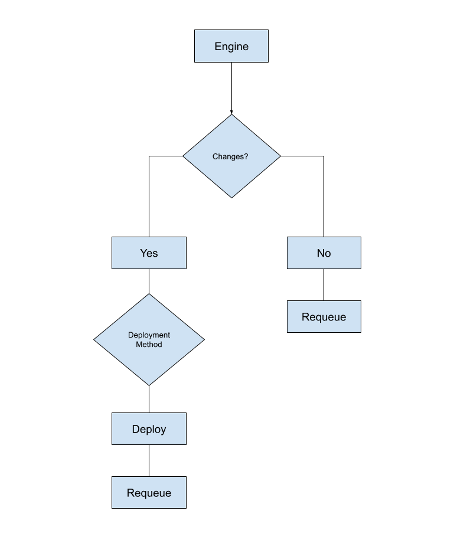
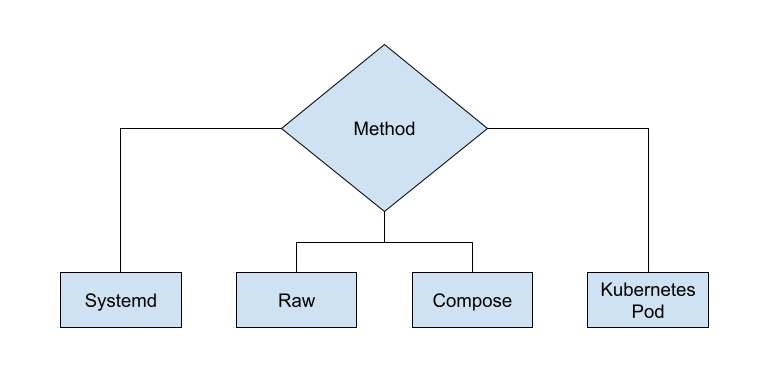

Engine
=====
The Harpoon engine does the heavy lifting of the container management process. The engine will interact with the git repository and ensure that the system is running those items in the git repository as stated.

Configuration
=============
The engine references a file to ensure the repository and how to deploy the container.

Method
------

* raw - Deploys a container based on a json definition.
* compose - Base on podman `compose <https://github.com/containers/podman-compose>`_
* kubernetes pod - Allows the deployment of containers based on the `pod <https://developers.redhat.com/blog/2019/01/15/podman-managing-containers-pods#podman_pods__what_you_need_to_know>`_
* systemd - Allows for a systemd file to be created on the system `systemd <https://github.com/containers/podman/blob/main/docs/source/markdown/podman-generate-systemd.1.md>`_

Git
---
This field defines the git repository that the engine should follow.

Branch
------
A specific branch should be fined within the repository for the engine to follow.

Directory
---------
Directory references the location that the repository will be cloned to on the system

Subdirectory
------------
This is the specific subdirectory containing the json file(s) to be deployed and managed by the engine.

